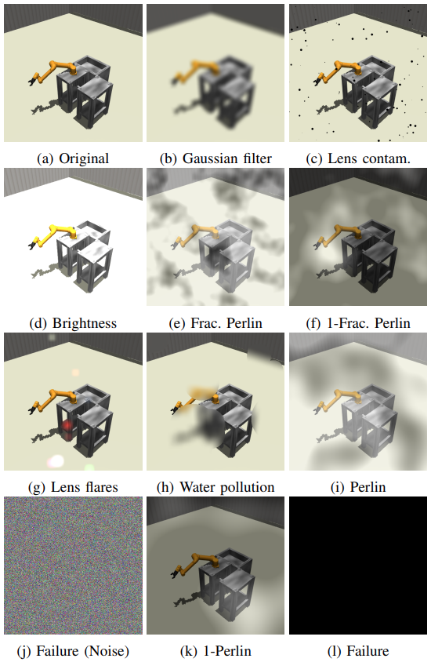

# Multimodal Synthetic Dataset Balancing

Deep neural networks perform well on clean, unimodal data (e.g., sensors, images, or audio). While multimodal data can enhance performance, real-world industrial settings often face data corruption (e.g., noise, blur, or sensor failures), leading to significant performance drops. Existing data augmentation techniques primarily focus on improving model generalization but fail to simulate realistic industrial scenarios. This repository provides **industry-specific augmentation methods** for **temporal and spatial data**, tailored for **multimodal fusion** in deep neural networks. Our approach:  Add commentMore actions

- Promotes **modality collaboration**  
- Strengthens **generalization** under real-world conditions
- Realistic industrial augmentation for **temporal & spatial data**    

Explore the code to implement these augmentations in your multimodal deep learning pipelines!  


### 🚨 Anomaly Injection

The following image demonstrates sample augmentations from our pipeline, showcasing realistic industrial failure modes simulated in multimodal data. These include sensor noise injections, temporal misalignments between modalities, and spatial corruptions mimicking equipment degradation. Each example reflects common challenges encountered in real-world industrial settings. The failure injection is based on our pre-work [1].

<p align="center">
  
</p>

### 📦 Prerequisites

Before you begin, ensure your environment meets the following requirements:

* **Python** ≥ 3.6
* **PyTorch** ≥ 1.0 (CUDA support recommended for faster training)

We also recommend using a virtual environment (e.g., `venv` or `conda`) to avoid package conflicts.

## 🔗 Multimodal Robot Kinematic Datasets

This repository provides access to three multimodal robot movement datasets, each including at a minimum the **camera** and **kinematics** modalities. For detailed descriptions of the datasets, data collection procedures, and experimental use cases, please refer to our paper [2]:

**"Performance benchmarking of multimodal data-driven approaches in industrial settings"** – [Link to Paper](https://www.sciencedirect.com/science/article/pii/S266682702500074X?via%3Dihub)

1. **MuJoCo: UR5 Robot Motion** – [Link to Dataset 1](https://zenodo.org/records/14041622)
2. **ABB Studio: Single Robot Welding Station** – [Link to Dataset 2](https://zenodo.org/records/14041488)
3. **ABB Studio: Dual Robot Welding Station** – [Link to Dataset 3](https://zenodo.org/records/14041416)

Each dataset captures robot motion across various tasks and environments, providing synchronized data streams for machine learning and robotics research.

## 📌 Citation
If you use this code or build upon our work, please cite our paper:


```bibtex
@inproceedings{altinses2023multimodal,
  title={Multimodal Synthetic Dataset Balancing: A Framework for Realistic and Balanced Training Data Generation in Industrial Settings},
  author={Altinses, Diyar and Schwung, Andreas},
  booktitle={IECON 2023-49th Annual Conference of the IEEE Industrial Electronics Society},
  pages={1--7},
  year={2023},
  organization={IEEE}
}
```


## 📚 Related Projects 

This project builds on concepts from multimodal representation learning, attention-based fusion, and anomaly detection in industrial systems. Below are selected related works and projects that inspired or complement this research:

<a id="1">[1]</a> Altinses, D., & Schwung, A. (2023, October). Multimodal Synthetic Dataset Balancing: A Framework for Realistic and Balanced Training Data Generation in Industrial Settings. In IECON 2023-49th Annual Conference of the IEEE Industrial Electronics Society (pp. 1-7). IEEE.

<a id="2">[2]</a> Altinses, D., & Schwung, A. (2025). Performance benchmarking of multimodal data-driven approaches in industrial settings. Machine Learning with Applications, 100691.

<a id="3">[3]</a> Altinses, D., & Schwung, A. (2023, October). Deep Multimodal Fusion with Corrupted Spatio-Temporal Data Using Fuzzy Regularization. In IECON 2023-49th Annual Conference of the IEEE Industrial Electronics Society (pp. 1-7). IEEE.

<a id="3">[4]</a> Altinses, D., Torres, D. O. S., Lier, S., & Schwung, A. (2025, February). Neural Data Fusion Enhanced PD Control for Precision Drone Landing in Synthetic Environments. In 2025 IEEE International Conference on Mechatronics (ICM) (pp. 1-7). IEEE.

<a id="3">[5]</a> Torres, D. O. S., Altinses, D., & Schwung, A. (2025, March). Data Imputation Techniques Using the Bag of Functions: Addressing Variable Input Lengths and Missing Data in Time Series Decomposition. In 2025 IEEE International Conference on Industrial Technology (ICIT) (pp. 1-7). IEEE.


